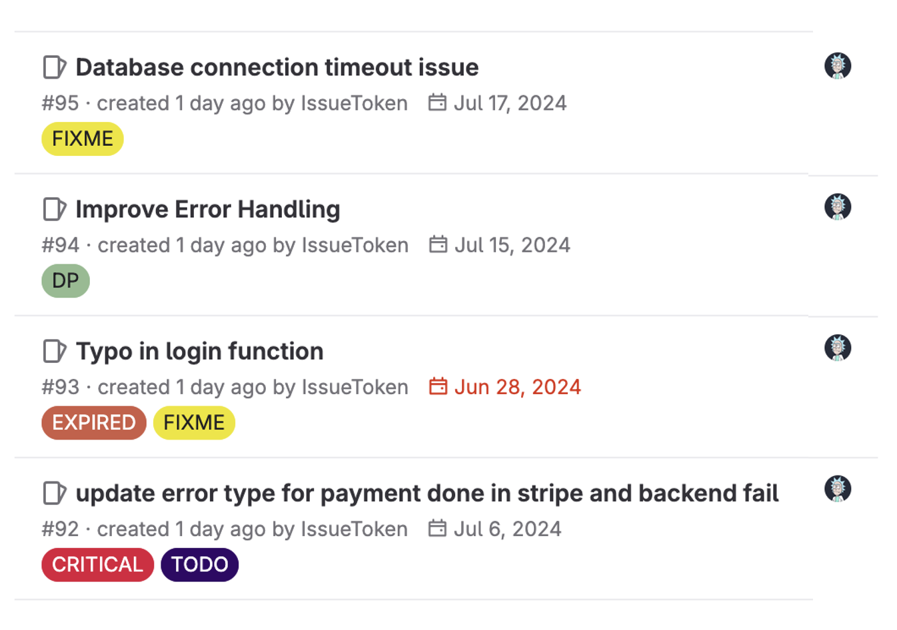
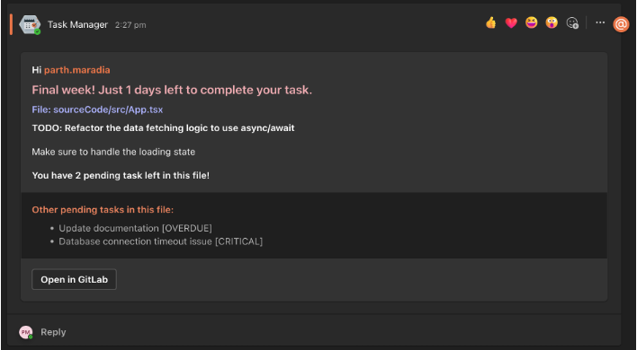

# Code Debt Workflow Manager: Comprehensive Comment Management System

Code Debt Workflow Manager is a powerful tool designed to manage and optimize comments within software development projects to track and resolve code debts. Whether you're working on code reviews, issue tracking, or collaboration, our system helps streamline the management and utilization of comments effectively.

## Features

- **Custom ESLint Rule**: Automatically enforces comment standards and best practices tailored to your project's needs.
- **GitLab Integration**: Creates GitLab issues directly from comments, facilitating seamless issue tracking and management.
- **Teams Alerts**: Notifies team members about critical comments and issues via Microsoft Teams for enhanced collaboration and responsiveness.
- **Parser**: Custom Parser to asynchronously parser source code and creates a standardized JSON data file that will be used by other elements.

## Installation

### Prerequisites

Before installing our system, ensure you have the following dependencies installed:

- Node.js (>= 12.x)
- npm (>= 6.x)

### Installation Steps

1. Clone the repository:

   ```bash
   git clone https://github.com/Parth0248/Comments-Manager.git
   cd Comments-Manager
   ```

2. Install dependencies:

   ```bash
   npm install
   ```

3. Create a `.env` file at the root directory and add the following variables:

   ```
   ACCESS_TOKEN=your_gitlab_access_token_here
   WEBHOOK_URL=your_microsoft_teams_webhook_url_here
   GITLAB_PROJECT_ID=your_gitlab_project_id_here
   DOMAIN_NAME=@your_domain_name
   ```

   Replace `your_gitlab_access_token_here`, `your_microsoft_teams_webhook_url_here`, `your_gitlab_project_id_here` and `your_domain_name` with your actual GitLab access token, Microsoft Teams webhook URL, GitLab project ID and domain name (used for MS Teams tagging) respectively.

4. Scripts to run the application:

   ```json
    "lint": "npx eslint ./sourceCode/",
    "extract-tasks": "node ./scripts/taskParser",
    "create-issue": "node ./scripts/gitLabIssue/",
    "send-alert": "node ./scripts/teamsAlert/",
    "code-debt-manager": "node ./scripts/"
   ```

   use `npm run script_name` to run respective scripts and to run all elements in order run `npm run code-debt-manager`. This will run the scripts in the order mentioned above.

## Usage

### Task Parser

Assign path of source directory where you wish to intergrate this system using CLI config feature or add changes directly to `scripts/configs/defaultConfig.js`. The script will store the data directly to the `OUTPUT_DIR` set in configs.

The Parser uses Regex Patterns for detecting and extracting the matched comments. To add custom pattern, make changes to `scripts/taskParser/syntax` directory and handle imports accordingly. Our system uses the same syntax file for enforcing custom ESLint Rule.

### ESLint Rule

To enable the custom ESLint rule, add `"plugin:comment-manager/recommended"` to the `extends` section of your ESLint configuration file (e.g., `.eslintrc.json`, `eslint.config.js`).

### GitLab Integration

Code Debt Workflow Manager integrates with GitLab to create issues from comments automatically. The script tracks the current status of each issue and adds those changes directly to the JSON data file.


### Teams Alerts

Configure Microsoft Teams alerts by adding the generated webhook URL (`WEBHOOK_URL`) to your Microsoft Teams channel. It sends alerts for important comments and issues directly to this channel.


### Configuration Files

#### `scripts/configs/configs.js`

Gives option to set custom config options:

```js
Output directory : "-o, --output <path>"
Source code directory : "-s, --src <path>"
File types : "-f, --filetype <type>" 
Task types : "-t, --tasktype <type>"
Ignore directories : "-i, --ignoredir <dir>"
```
#### Usage

Add the desired configuration as shown below:

`npm run script_name -- -o path_to_output_dir`


## Contributing

Contributions are welcome! Fork the repository and submit a pull request with your changes.

## License

This project is licensed under the MIT License - see the LICENSE file for details.

---
## For more Info. 

[Presentation Link](https://docs.google.com/presentation/d/1xCYGu95fz0RTeMRMnqBAt6FsphtpXA5B/edit?usp=sharing&ouid=112827553763690454275&rtpof=true&sd=true)
